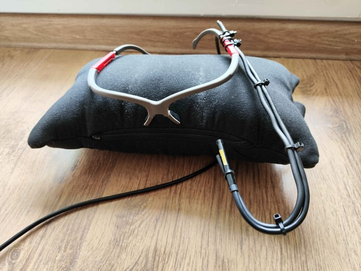
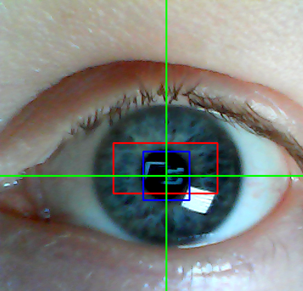
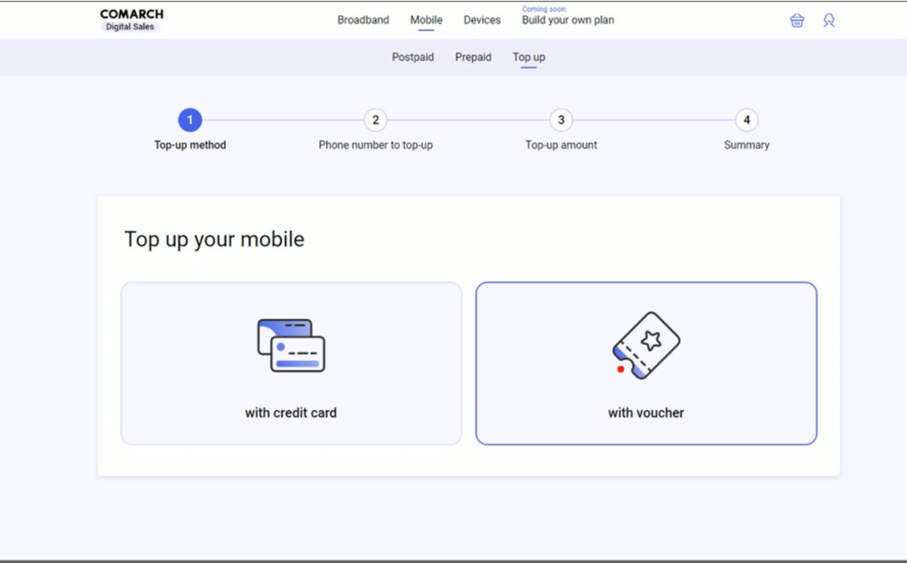
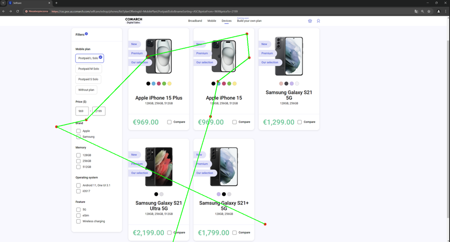
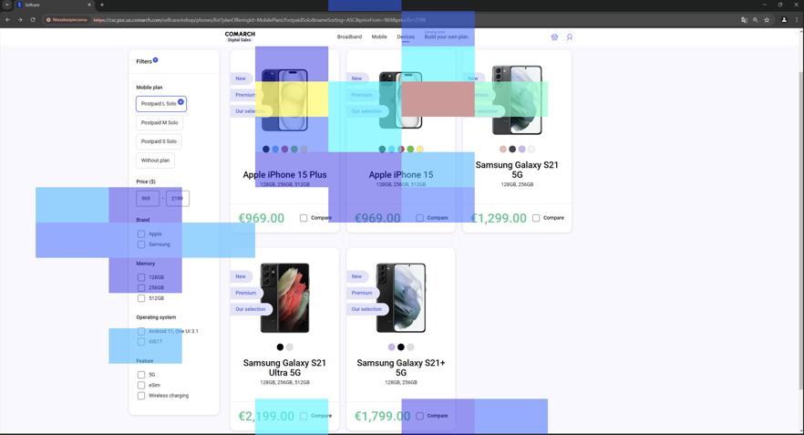

# Eye Tracker for UX Design analysis
A device using endoscopic camera to track the user's gaze to create heatmaps and gazeplots maps for UX Design analysis. Project created in cooperation with Comarch company.

## Technologies
* Python3
* OpenCV
* NumPy

## Practical applications
* Analysis of website readability.
* Understanding the user's cognitive processes.
* Evaluation of elements responsible for attracting the user's attention.

## Features
* A device created with glasses and endoscopic camera.

* Personal calibration for any user. \

* Tracking the user's gaze.

* Recording the screen during the UX Design test.
* Creating hetmaps and gazeplots maps to UX Design analysis.

### Gazeplots map

### Heatmap

## Authors
* Jakub Suski
* Kacper Krzesiński
* Piotr Komarnicki
* Adam Czekalski

Special thanks to Comarch company for helping to create the project.